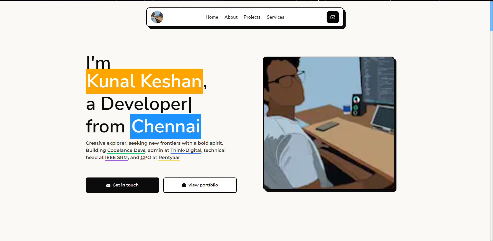

# kunalkeshan.dev Portfolio

    

Welcome to my portfolio v2.0, I don't remember where v1.0 is so don't ask me about it. This project is an inspiration from another portfolio template called [Paperfolio](https://paperfolio.webflow.io/) and I've customized it to my own needs and preferences.

This project is fully responsive, with extendable features and consistent design. Showcasing your best skills, projects and experiences. Feel free to fork and use for your own portfolio.

Below I've mentioned a general overview of my portfolio and how you can fork and use it for your own as well (make sure to tag me 😉)

**Table of Contents**:

- [Technologies Used](#technologies-used)
- [Features](#features)
  - [Landing Page](#landing-page)
  - [About Page](#about-page)
  - [Contact Page](#contact-page)
  - [Projects Page](#projects-page)
  - [Tributes Page](#tributes-page)
- [Upcoming Features](#upcoming-features)
- [Contributing](#contributing)
  - [Forking this repo](#forking-this-repo)
  - [Contributors](#contributors)
- [License](#license)

## Technologies Used

- 🖥️ Next.js: Frontend framework
- 💻 Custom Backend: Built with Node.js, Express.js, and TypeScript [api.kunalkeshan.dev](https://github.com/kunalkeshan/api.kunalkeshan.dev)
- 🎨 Framer-Motion: Animation library
- 🎯 React-Icons: Icon library
- 💻 Frontend & Backend: Implemented with TypeScript 💬

## Features

- 📱 Responsive: Looks great on all devices.
- 🎨 Consistent Design: A clean, polished look throughout.
- 🔥 Showcasing Experience, Projects and Skills: A comprehensive overview of my background.
- 🚀 Optimized for Faster Loading: Quick and efficient loading time.
- 🙏 Created with Accessibility in Mind: Accessible to everyone, regardless of abilities.

### Landing Page

- 💡 Intro: A brief overview of your background and what you bring to the table.
- 🙋‍♀️ Small About: A quick look at who you are and what you're passionate about. 🔥
- 💼 Present Experience: A rundown of your current work experience and skills.
- 🔥 Featured Projects: A showcase of your best and most recent projects. 💻
- 💬 Testimonials: A collection of positive reviews and feedback from clients and colleagues. 💯

### About Page

- 💡 Intro: A brief overview of who I am and what I bring to the table.
- 📖 My Story: A look at my journey and how I got to where I am today.
- 📄 Full Resume: A comprehensive overview of my work experience and skills.
- 💚 My Values: A list of what's important to me and what drives me.

### Contact Page

- 📧 My Email: My professional email address for contacting me.
- 💻 My Social Links: My social media profiles where I can be reached.
- 📩 Form to Contact Me: A form that visitors can fill out to get in touch with me. The form is built with a custom backend and contributors can create their own custom implementation.
- ❓ FAQ Section: A collection of frequently asked questions about myself and my services, with answers provided.

### Projects Page

- 💻 Project Information:
  - 🔧 Tech Stack: A list of technologies used in the project.
  - 🔗 Links: Github and hosted URL to view the project.
- 🔍 Overview: A brief description of the project and what it does.
- 💡 Motivation: The reason behind creating the project and what problem it solves.
- 📷 Images Gallery: A collection of images showcasing the project and its features.

### Tributes Page

- 🙏 Tribute Information:
  - 📅 When We Connected: The time when I met the person or started following their work.
  - 💼 Current Role: The current occupation and role of the person.
  - 💻 Social Links: The person's social media profiles.
- 💬 My Tributes to the Person: A heartfelt message to the person and why they inspire me.
- 📚 Lessons I've Learnt from That Person: Key insights and lessons I've learned from the person and how they've impacted my life.

## Upcoming Features

- Admin Page - make pages data dynamic with the admin setup.
- Links Page - automates links from my blog, social media and custom implementation from admin page.
- Feeds Page - Shows all latest social media updates in one location.
- Blog Page - Fetches latest information from Hashnode blog

## Contributing

Anybody is free to contribute to this repo. If you think you can improve the quality of this repo, follow the contributing guidelines mentioned at [CONTRIBUTING.md](./CONTRIBUTING.md).

### Forking this Repo?

Many people have contacted us asking if they can use this code for their own websites. The answer to that question is usually "yes", with attribution. There are some cases, such as using this code for a business or something that is greater than a personal project, that we may be less comfortable saying yes to. If in doubt, please don't hesitate to ask us.

We value keeping this project open source, but as you all know, plagiarism is bad. We actively spend a non-negligible amount of effort developing, designing, and trying to perfect this iteration of our project, and we are proud of it! All we ask is to not claim this effort as your own.

So, feel free to fork this repo. If you do, please just give us proper credit by linking back to this repo, https://github.com/kunalkeshan/kunalkeshan.dev. Refer to this handy [quora](https://www.quora.com/Is-it-bad-to-copy-other-peoples-code) post if you're not sure what to do. Thanks!

### Contributors

## License

This project is licensed under the [Mozilla Public License](./LI).
